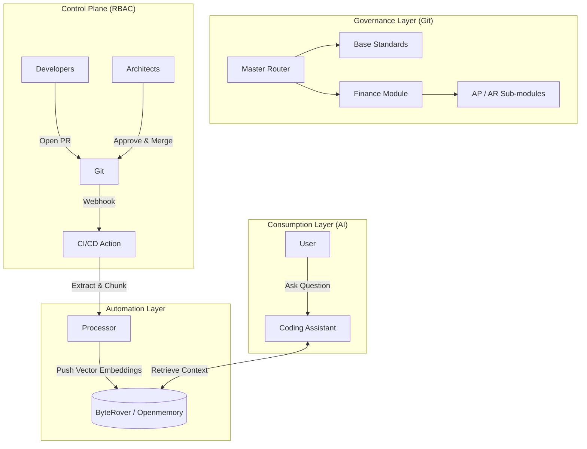

# AG Enterprise Knowledge Base: Complete Solution Architecture

**Version:** 1.0.0
**Date:** 2025-12-12

---

## 1. 🎯 Executive Summary

The proposed solution establishes a **Centralized, Governed, and AI-Ready Knowledge Base** for Oracle Fusion SQL development. It solves the problem of decentralized knowledge ("tribal knowledge") and uncontrolled AI responses by implementing a **Hybrid Architecture**:

1.  **" The Law" (Source of Truth):** A strictly governed Git Repository.
2.  **"The Brain" (Consumption Layer):** An AI Memory System (ByteRover/Openmemory).

---

## 2. 🏛️ System Architecture



---

## 3. 📂 The "Golden Source" Structure

### Directory Layout
```text
AG_KNOWLEDGE_BASE/
├── .github/
│   ├── CODEOWNERS              ← Leveled Access Control
│   └── workflows/
│       └── sync_to_memory.yml  ← CI/CD Pipeline
│
├── MASTER_ROUTER.md            ← Entry Point
├── KB_GOVERNANCE.md            ← Policy Document
│
├── 00_BASE_STANDARDS/          ← [LOCKED] Universal Rules
│
└── FINANCE/                    ← [DELEGATED] Finance Domain
```

### Role-Based Access Control (RBAC)
We use the `.github/CODEOWNERS` file to enforce the following permissions:

| Path | Role | Responsibility |
|------|------|----------------|
| `/00_BASE_STANDARDS/` | **Chief Architect** | Universal SQL syntax, performance rules. |
| `/FINANCE/` | **Finance Lead** | Domain-specific business logic. |
| `*.md` | **Developers** | Read-Only (must Fork & PR to contribute). |

---

## 4. ⚙️ Technical Implementation

### The "Push" Pipeline (CI/CD)
Configure a GitHub Action to sync changes to ByteRover.

**File:** `.github/workflows/sync_kb.yml`
```yaml
name: Sync to AI Memory
on:
  push:
    branches: [ "main" ]
    paths: [ "**.md" ]

jobs:
  ingest:
    runs-on: ubuntu-latest
    steps:
      - uses: actions/checkout@v3
      - name: ByteRover Ingestion
        uses: byterover/ingest-action@v1
        with:
          api_key: ${{ secrets.BYTEROVER_KEY }}
          source_dir: "./"
          strategy: "markdown-header-split"
```
